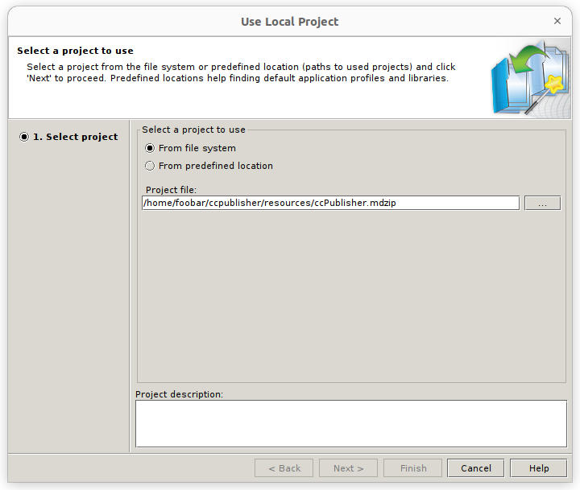
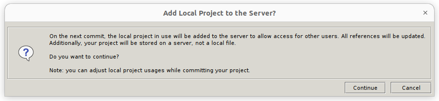
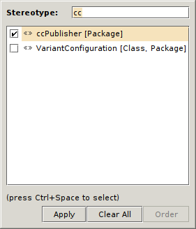
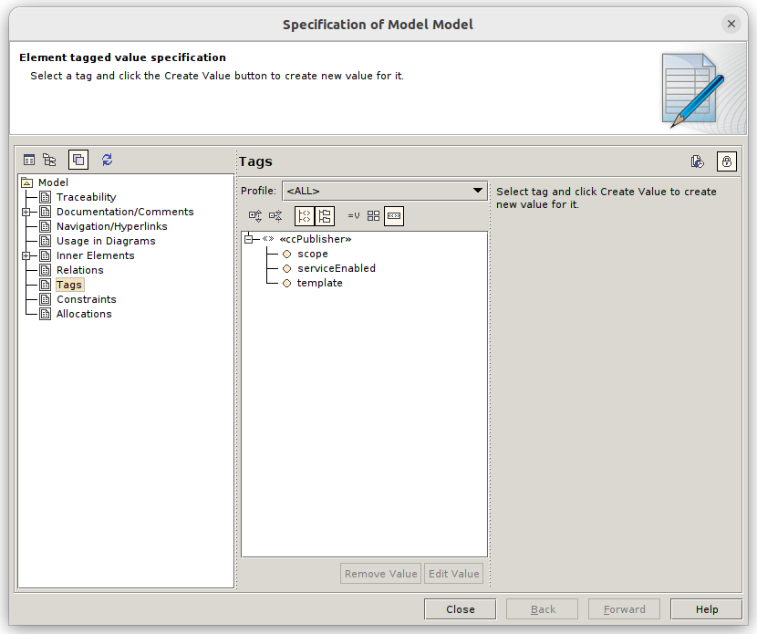
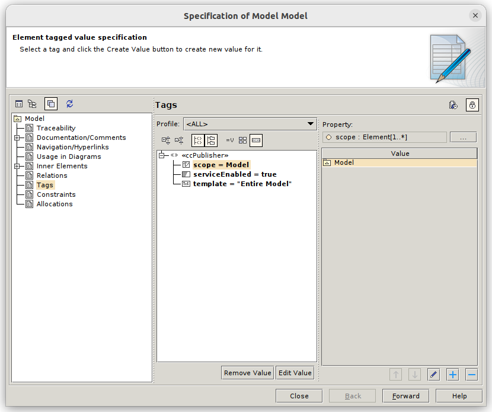

*************
Project setup
*************

The service scans the resources available in Teamwork Cloud, searching those that meet the following conditions:

* `<<ccPublisher>>` stereotype applied to the top level Model
* Tag `serviceEnabled` (`<<ccPublisher>>`) is set to `true` or is unset

`<<ccPublisher>>` stereotype is provided within the `ccPublisher.mdzip` project file located in the `resources`
folder.

Include the profile
===================

The profile can be included by importing the provided mdzip file:

1. Open the target server project
2. Select `File -> Use Project -> Use Local Project`
3. Select `From the file system` and press the three dots to select the mdzip file

4. Push `Continue`

Configure the parameters
========================

1. Unlock the `Model` (root node of the loaded server project)
2. Right mouse on `Model -> Stereotype`
3. Type `cc`, `<<ccPublisher>>` should pop up: mark the checkbox and press `Apply`

4. Open the specification panel of `Model` and select `Tags` on the left pane

5. Create a value for `serviceEnabled`, setting it to `true`
6. Create a value for `template`, typing `Entire Model` (or any other template available)
7. Create a value for `scope`, selecting the package or packages that should be exported to CC

The resulting tags should look like:

Commit and head back to the service
===================================

Once done, commit to push the changes to the server.

The ccpublisher service must be restarted every time a new project is added to the list. Future versions might allow
an online rescan.

Restart the service with::

    $ sudo systemctl restart ccpublisher

And then head to the service's UI: http://localhost:9999
