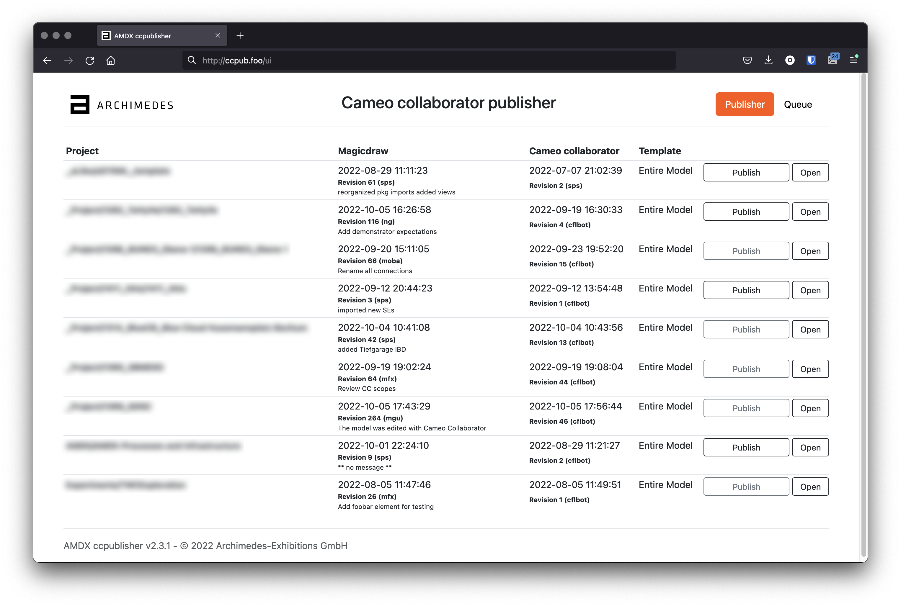
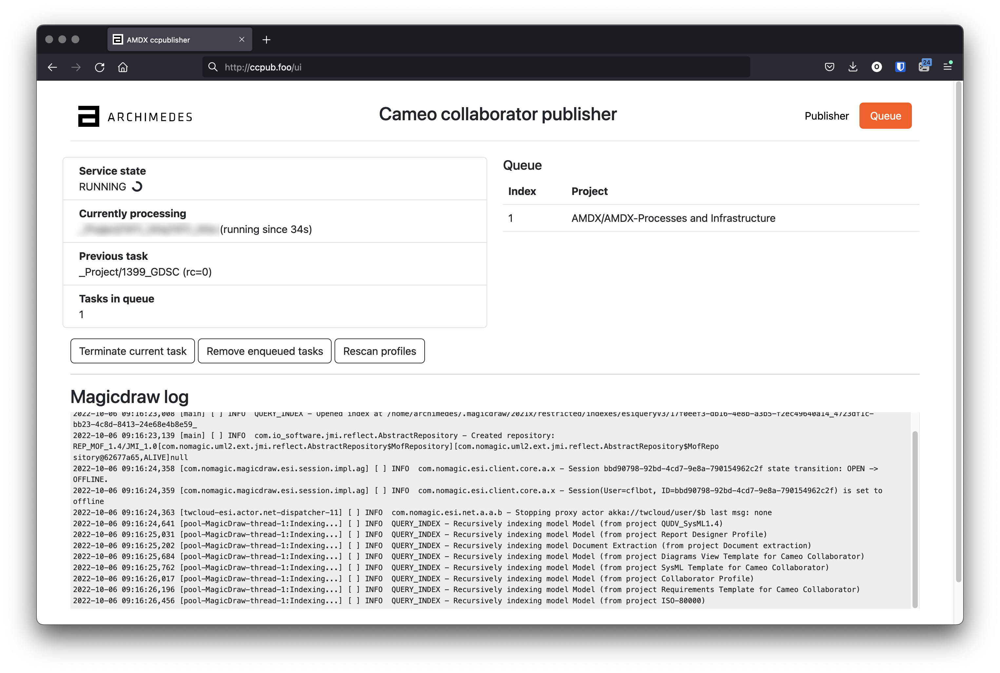

**************************
ccpublisher User Interface
**************************

The user interface is reachable via browser, at the address http://<host>:9999

Notice that the port can be changed in the configuration file of the service.

The elements of the page are described as:

* `Project`: name of the project. Only registered projects appear here (see :doc:`../installation/project`)
* `MagicDraw`: information about the last commit available for the MD resource
* `Cameo collaborator`: information about the last commit for the CC resource
* `Template`: which template will be used when publishing (see :doc:`../installation/project`)
* `Publish`: enqueue the publishing for the related project
* `Open`: open the related Cameo collaborator resource in the browser

Publish a project
=================

The `Publish` button has black outlines in case the CC resource is older than the MD one. In this
case, publishing will publish the new changeset into the CC resource.

A grey outline indicates that the CC resource is newer than the MD one. The button can still be pressed
in order to perform again the publishing.

When a publishing operation is carried on, the publish button shows a spinner:

Queue
=====

Publishing resources is done serially so each request is put into a queue. The maximum number of jobs
that can be enqueued are defined in the configuration. More here: :doc:`../installation/service`.

By switching pane on the UI, queue and log can be inspected:

* `Service state`: whether the service is busy publishing or idle
* `Currently processing`: shows which project is being currently published
* `Previous task`: shows the previously published project
* `Queue`: waiting publishing tasks are shown here
* `Magicdraw log`: realtime stream of the log

The buttons allow to:

* `Terminate current task`: if a task is running, terminate the publishing and proceed to the next (if any)
* `Remove enqueued tasks`: cancel all the tasks pending in the queue
* `Rescan profiles`: import all the projects that are configured and enabled. More here: :doc:`../installation/project`

Rescanning the profiles might take long time. The interface refreshes automatically at the end
of the process.
